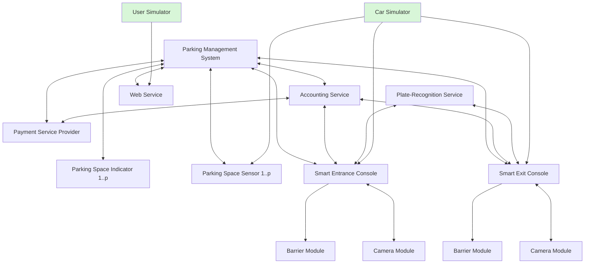

This is the repository for the SORRIR-demonstrator, an application implemented with the SORRIR-Framework to demonstrate it's capabilities.

# Structure

The demonstrator is based on the [Smart Parking Garage use-case](https://gitlab-vs.informatik.uni-ulm.de/sorrir/sorrir-meta/-/blob/master/Arbeitspakete/AP5/Validierungsszenarien/validation-scenarios.pdf). Some components were omitted (e.g. `Car Navigation Box (CNB)` and `Routing Service (RS)`) and some new ones added (`External Control (EXT)` and `User Interface (UI)`). The new components (`EXT` and `UI`) are designated to mimmick interaction of the other componentes with either the real world or users. `EXT` in particular is a mock-component that is not supposed to be deployed, it exists to provide controllable API end-points in some components.



# Running the demonstrator

By default, all components run within the same unit `a`. The communication is mostly internal. Start the demonstrator with

```sh
npm run start -- --to-execute=a
```

If you want to only observe the component-states, you can also use
```sh
npm run start -- --to-execute=a | awk '/<<< COMPONENT STATES >>>/,/<<< END OF COMPONENT STATES >>>/'
```
instead.

Afterwards, interactions of the smart parking garage can be simulated via events of the external components `cs` (Car Simulator) and `us` (User Simulator).

To test external communcation protocols between the components, run the alternative configuration `ext-comm` via the `--env=development` flag. This configuration has multiple units (`a`,`b` and `c`) that need to be started separately.

## Off-Site Reservation Request

```sh
npm run sendEvent -- -- --source us --target ws --type REQUEST_RESERVATION --class request --port FROM_US --param '{"accountID":"sorrir1","dateFrom":"2022-01-01T00:00Z","dateTo":"2022-01-01T01:00Z"}'
```

## Arrival at smart entry console

```sh
npm run sendEvent -- -- --source cs --target sec --type CAR_DETECTED --class oneway --port FROM_CS --param '{"timestamp":"2022-01-01T00:01Z"}'
```

## Feeding image data for Plate recognition

```sh
npm run sendEvent -- -- --source cs --target cm_sec --type FEED_IMAGE_DATA --class oneway --port FROM_CS --param '{"imageData":"SO-RR1"}'
```

## On-Site Reservation Request

Uses account data recognized via license plate.

```sh
npm run sendEvent -- -- --source us --target sec --type REQUEST_RESERVATION --class request --port FROM_US --param '{"dateTo":"2022-01-01T01:00Z"}'
```

## Driving through/Leaving smart entry console

```sh
npm run sendEvent -- -- --source cs --target sec --type CAR_DETECTION_ENDED --class oneway --port FROM_CS
```

## Arriving at parking space

The `pss_id` has the format `pss_<level>_<row>_<column>`. All dimension are padded by leading zeros to always have the same number of letters, following the greatest dimension.
E.g. in a parking garage with 1 level, 10 rows and 100 columns, the `pss_id` has the format `pss_lll_rrr_ccc`.

```sh
npm run sendEvent -- -- --source cs --target <pss_id> --type SET_OCCUPIED --class oneway --port FROM_CS
```


